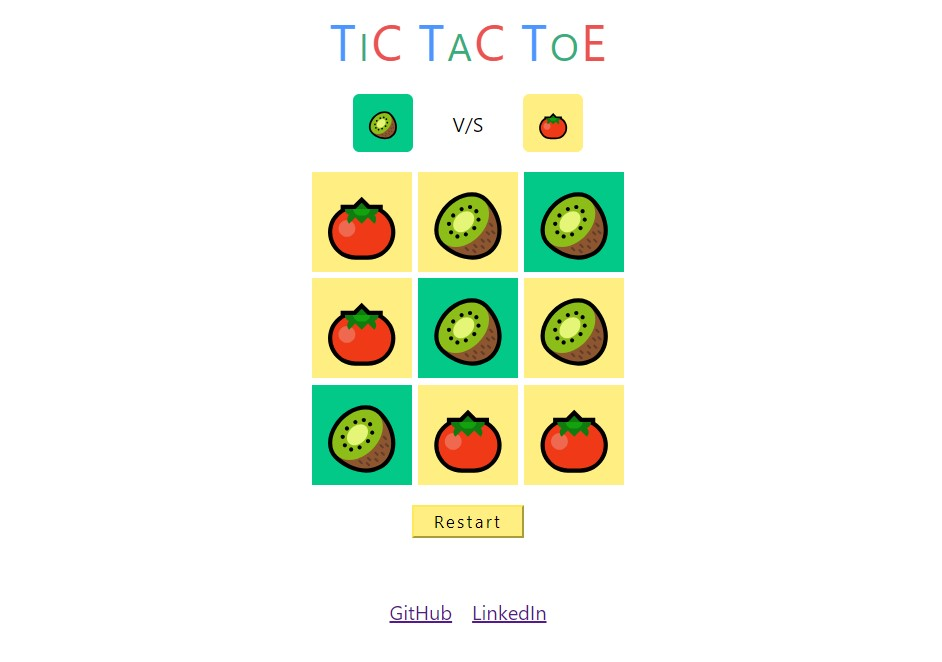

# Tic Tac Toe with fruits and veggies

Tic Tac Toe game made with fruits, vegetables and core concepts of JavaScript

🍌 🍉 🍓 🍒 🍍 🍇 🍑 🥭 🍊 🍎 🥝 🍅 🍆 🥑 🥦 🥒 🥬 🥕 🌽 🥔 🧅 🍄

#### [Click here to play!](https://hashirhussain.github.io/tic-tac-toe/)

### Run in your computer

You don't need to install anything, just clone this repo and open `index.html` file in your favorite browser.

### Source code contains

1. `index.html` - HTM:L file required by browser to print content on screen.
2. `style.css` - to apply CSS styles on HTML elements.
3. `tac-tac-toe.js` - contains JavaScript logic for game execution.

### Scope of improvements

- Play with Bot
